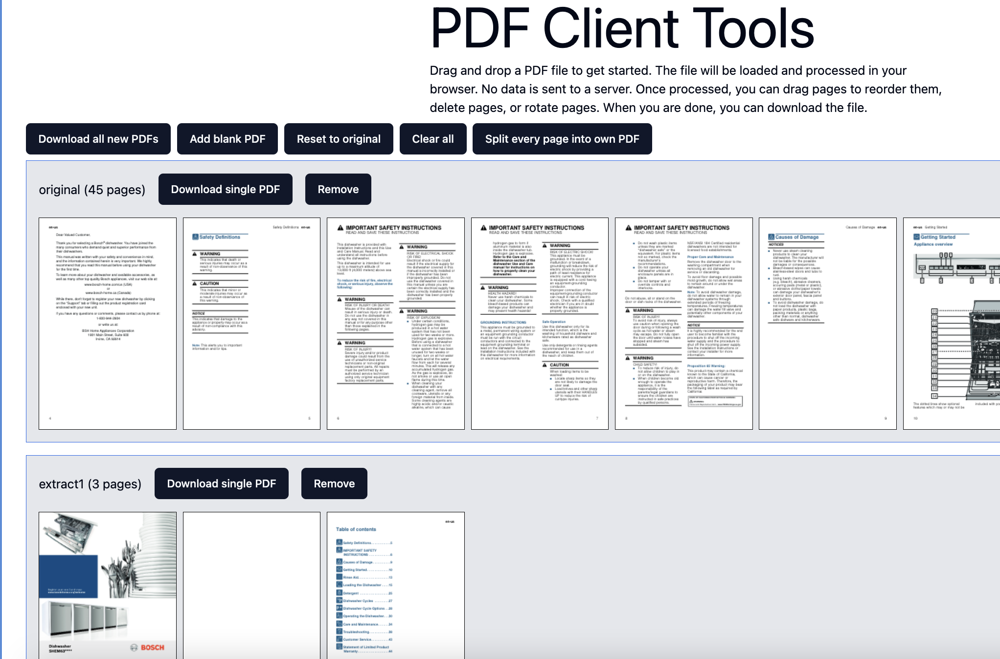

# PDF Client Side

This is a tool that rearranges PDFs using only client side JS.

## Libraries

- Importing `PDFDocument` from `pdf-lib` for PDF manipulation.
- Importing `pdfjsLib` and `pdfWorker` from `pdfjs-dist` for PDF rendering.
- Importing `create` from `zustand` for state management.
- Using `shadcn-ui` for components

## Summary of Code Features

### Type Definitions

- `PDFPage`: Defines a single page in a PDF.
  - `id`: Unique identifier for the page.
  - `imageData`: Base64-encoded image data.
  - `originalPageNumber`: The page number in the original PDF.
- `PDFList`: Defines a list of `PDFPage` objects.

  - `id`: Unique identifier for the list.
  - `pages`: Array of `PDFPage`.

- `ImportStore`: Zustand state shape.
  - State variables: `pdfLists`, `pdfBase64`, `pdfBuffer`, `isLoadingThumbnail`, `isDoingExtraction`.
  - Actions: Functions for state manipulation like `setOriginalList`, `setPdfLists`, etc.

### Zustand Store (`usePdfData`)

- Initializes with default state.
- Provides various methods for state manipulation and PDF operations.

### Functions

- `setOriginalList`:
  - Takes a base64 PDF string.
  - Creates a PDF list with thumbnails for each page.
- `setPdfLists`: Sets the `pdfLists` state.

- `downloadAllPdfs` and `downloadSinglePdf`:

  - Downloads selected PDFs.
  - Utilizes `createPdfFromList` for the actual PDF creation.

- `addBlankPDF`: Adds a new empty PDF list.

- `clearAll`: Clears all state to initial state.

- `resetToOriginal`: Resets to the original list based on `pdfBase64`.

- `changeNameOfList`: Changes the name (id) of a given list.

- `splitEveryPageIntoOwnPdf`: Splits each page of the original PDF into its own new PDF.

- `removeSingleList`: Removes a single list by its ID.

### Utility Functions

- `createPdfFromList`: Creates a new PDF based on a given `PDFList` and original PDF document.
- `pause`: Utility to pause execution.

### General Flow

- The code primarily revolves around PDF manipulation using PDF.js for rendering and pdf-lib for operations like splitting, downloading, etc.
- It uses Zustand for managing the state of PDF lists and associated data.

## Migration from T3 Stack

This project was copied from another one built with the T3 stack. Changes below were needed to get to a simple client only application.

1. Remove prisma - no database
2. Remove `postinstall` script that ran prisma
3. Clear out extra pages in `app` - keep just the root
4. Remove extra comps - keep
   1. ui
   2. common
   3. Table
   4. nav
5. Remove trpc and auth from the `pages/api` - do not need for client only
6. Delete most lib related stuff - keep
   1. Non finance helpers
   2. utils
7. Delete the `server` folder and all of its code
